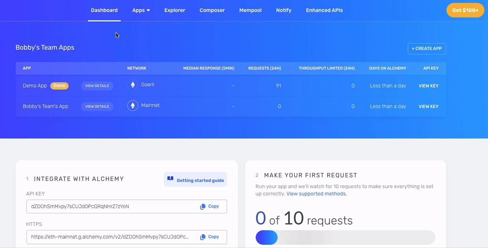
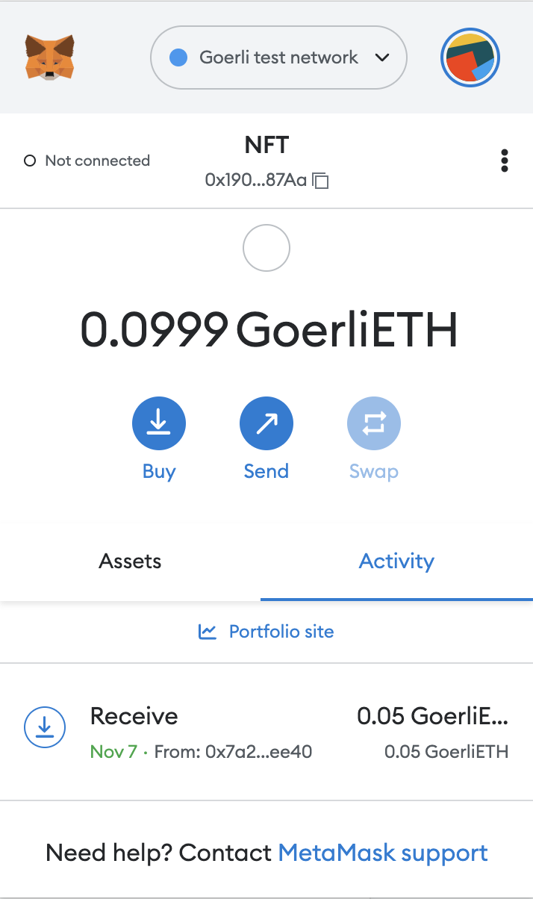
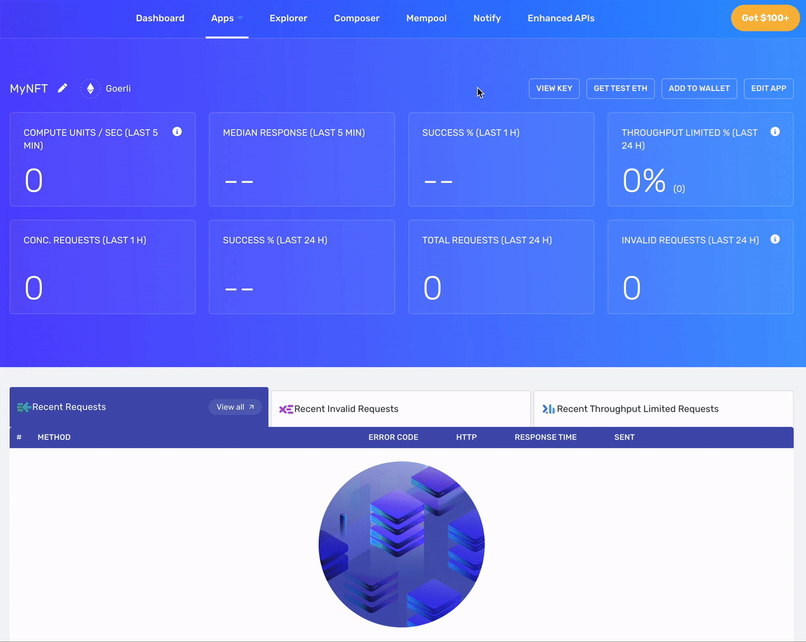
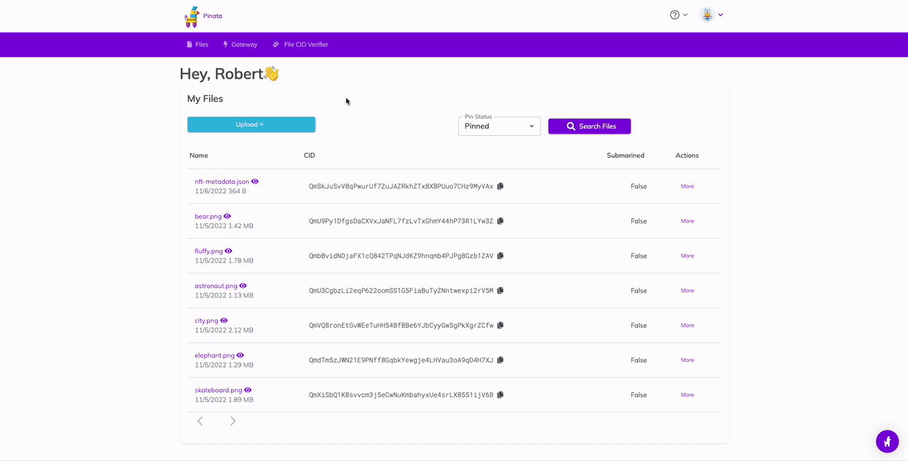
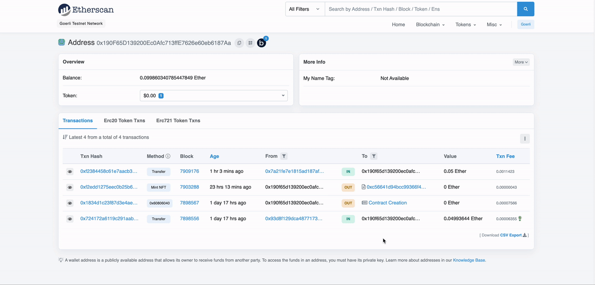
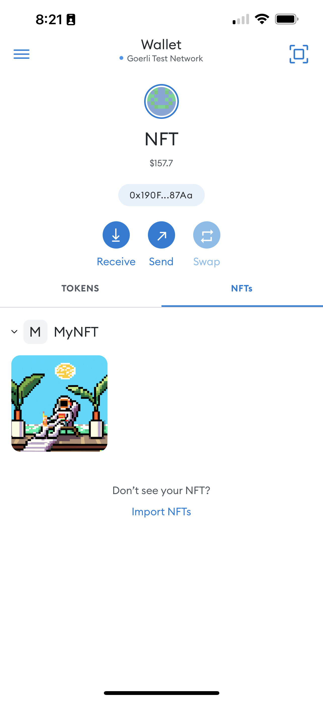

# MyNFT

Deploy an [NFT](https://en.wikipedia.org/wiki/Non-fungible_token) to the [Ethereum](https://ethereum.org/en/) network with [Alchemy](https://alchemy.com/?r=0e755050924e15d3), [Hardhat](https://github.com/NomicFoundation/hardhat), [Metamask](https://metamask.io/), and [Pinata](https://www.pinata.cloud/). This example assumes you have a basic understanding of Node.js, Web3, and Ethereum Wallets.

## 🥾 Steps 

In the [Alchemy](https://alchemy.com/?r=0e755050924e15d3) Dashboard, hover over the **Apps** header, choose **+ Create App**, name the app **MyNFT** and select the **Goerli Test Network**.



Click the **GET TEST ETH** button or navigate to the [Goerli Faucet](https://goerlifaucet.com/). Enter your wallet address and click **Send Me ETH**.


Switch metamask to the Goerli Test Network and ensure that you received some test ETH.



Clone this repository

```
git clone https://github.com/bobbyg603/nft
```

Install the project's dependencies

```
cd nft && npm i
```

Create a `.env` file at the project's root directory

```
touch .env
```

Copy the API url for your Alchemy app



Acquire the public and private keys for an address in your Metamask wallet and copy them.


Add values for `API_URL`, `PUBLIC_KEY`, and `PRIVATE_KEY` to your `.env` file by replacing the values in quotes below.

```
API_URL="https://eth-goerli.g.alchemy.com/v2/{{ your API key }}"
PUBLIC_KEY="{{your public key}}"
PRIVATE_KEY="{{your private key}}"
```

Deploy the contract to the Goerli Test Network

```sh
npx hardhat --network goerli run scripts/deploy.js

# Contract deployed to address: 0x4C5266cCc4b3F426965d2f51b6D910325a0E7650
```

Upload an image to Pinata to use as your NFT. If you don't have one, you can generate an image for free using [DALL-E](https://labs.openai.com/).



Copy the `CID` value of the image you uploaded to Pinata. Edit the `nft-metadata.json` file and replace the value in the `image` property with the `CID` of the image you uploaded to Pinata.

```json
{
  "attributes": [
    {
      "trait_type": "Planet",
      "value": "Earth"
    }
  ],
  "description": "Astronaut enjoying a drink at a tropical resort.",
  "image": "ipfs://{{ Replace with your image CID }}",
  "name": "Captain Cook"
}
```

Upload `nft-metadata.json` to Pinata and copy it's `CID`. Modify `scripts/mint-nft.ts` and replace the string value being used to call `mintNFT` with the `CID` of your `nft-metadata.json` file

```ts
mintNFT("ipfs://{{ Replace with your nft-metadata.json CID }}");
```

Mint your NFT

```sh
ts-node scripts/mint-nft
```

Find your NFT's contract by searching your public address in [goerli.etherscan.io](https://goerli.etherscan.io/) and clicking the link that says **Contract Creation**. Copy the contract's address.



Add your NFT to your Metamask wallet, note that you can only see NFTs in the mobile wallet



Congratulations! 🎉🥳🙂

You just deployed a new NFT contract and minted your first NFT! Now go do it on the Ethereum mainnet!

## 🧑‍🏫 Additional Learning

This tutorial was adapted from a tutorial on [ethereum.org](https://ethereum.org/). For a more in depth explanation of the topics covered above please check out this [article](https://ethereum.org/en/developers/tutorials/how-to-write-and-deploy-an-nft/).
